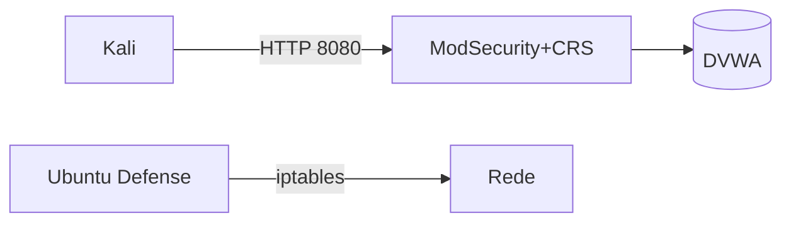

# RELATÓRIO – Opção 1 (Hands‑on)
> Nome: <Hannah> · Data: 2025-09-26

## 1. Sumário Executivo
**Visão geral:** Ambiente com container atacante (Kali), WAF ModSecurity (OWASP CRS) e aplicação alvo DVWA. Ataques simulados (SQLi e XSS) foram executados contra a DVWA e monitorados via Dozzle. O WAF atuou em **modo blocking**, gerando bloqueios `403 Forbidden` quando o inbound anomaly score foi excedido.

**Resultado:** Regras do CRS detectaram e bloquearam SQLi e XSS (IDs de regra observadas: `942100` para SQLi e `941100` para XSS). Evidências de logs estão anexadas.

## 2. Objetivo e Escopo
- **Objetivo:** Avaliar a detecção e bloqueio de ataques web (SQLi e XSS) usando ModSecurity + OWASP CRS sobre tráfego entre um host atacante (Kali) e a aplicação vulnerável (DVWA).
- **Escopo:** Testes de ataques aplicacionais (refletidos) via HTTP GET/requests; análise de logs do WAF/NGINX e evidências de bloqueio. Não foram testadas técnicas de evasão avançadas, nem ataques de disponibilidade.

## 3. Arquitetura (Diagrama)


**Descrição:** O tráfego do Kali passa pelo WAF (Nginx + ModSecurity com OWASP CRS v4.18.0). O WAF avalia requisições e aplica anomally scoring; se o `inbound_anomaly_score_threshold (900110)` for atingido (>=5), acontece bloqueio (regra `949110`).

## 4. Metodologia
1. Preparação do ambiente: levantar containers (kali_lab35, waf_modsec, dvwa) e confirmar serviços (Nmap).
2. Testes em **modo detecção**: enviar payloads de SQLi e XSS e validar que elas **passam** (status 302 observados no resumo).
3. Alteração para **modo blocking** (MODSEC_RULE_ENGINE=On / default do CRS) e reexecutar payloads.
4. Coleta de evidências: logs do container WAF (via Dozzle/docker logs) e geração de arquivo `logs_waf_evidencias.txt`.
5. Análise das entradas de log para identificar IDs de regras, timestamps, URIs, IPs e payloads.

## 5. Execução e Evidências

### 5.1 Reconhecimento (Nmap)
Trecho do Nmap (extraído do resumo):
```
Nmap scan report for waf_modsec (192.168.35.30)
PORT     STATE SERVICE  VERSION
8080/tcp open  http     nginx
8443/tcp open  ssl/http nginx
```

### 5.2 Evidências de bloqueio (logs)
Trechos relevantes extraídos de `logs_waf_evidencias.txt` (resumidos):

**SQLi - Detecção e bloqueio (timestamp: 2025-09-26 01:23:32 UTC)**
```
192.168.35.11 - - [26/Sep/2025:01:23:32 +0000] "GET /vulnerabilities/sqli/?id=1'+OR+'1'='1'--+-&Submit=Submit HTTP/1.1" 403 146 "-" "curl/8.15.0" "-"
...
"message":"SQL Injection Attack Detected via libinjection",
"ruleId":"942100",
"Matched Data: s&sos found within ARGS:id: 1' OR '1'='1'-- -"
...
"message":"Inbound Anomaly Score Exceeded (Total Score: 5)",
"ruleId":"949110"
```

**XSS - Detecção e bloqueio (timestamp: 2025-09-26 01:24:34 UTC)**
```
192.168.35.11 - - [26/Sep/2025:01:24:34 +0000] "GET /vulnerabilities/xss_r/?name=%3Cscript%3Ealert%28%22XSS%22%29%3C/script%3E HTTP/1.1" 403 146 "-" "curl/8.15.0" "-"
...
"message":"XSS Attack Detected via libinjection",
"ruleId":"941100",
"Matched Data: XSS data found within ARGS:name: <script>alert(\"XSS\")</script>"
...
"message":"Inbound Anomaly Score Exceeded (Total Score: 20)",
"ruleId":"949110"
```

**Observações:**
- As análises mostram que **regras específicas** (`942100` e `941100`) dispararam e contribuíram para o score que culminou no bloqueio pela regra `949110`.
- O `producer` no log indica `ModSecurity v3.0.14` e `OWASP_CRS/4.18.0`.

### 5.3 Outras evidências e avisos
- Aviso de SSL Stapling (issuer certificate not found) no startup do Nginx — não impactou a validação das regras.
- CRS configurado com `inbound_anomaly_score_threshold=5` (config de blocking_paranoia_level=1).

## 6. Resposta a Incidente (NIST IR) — resumo aplicado
- **Detecção:** Logs do ModSecurity/NGINX e Dozzle fornecem evidências e timestamps.
- **Contenção:** O WAF já aplica bloqueio (403) — conta como contenção imediata do tráfego malicioso.
- **Erradicação:** Para remover vetores, corrigir o código da aplicação (sanitização, prepared statements) e ajustar regras que causam false-positives.
- **Recuperação:** Revisar logs, re-testar funcionalidade legítima e ajustar paranoia level se necessário.
- **Lições Aprendidas:** Balancear sensibilidade da CRS com disponibilidade; usar modo DetectionOnly para tuning antes de migrar para Blocking.

## 7. Recomendações (80/20)
1. Manter o WAF em **DetectionOnly** durante tuning das regras e somente migrar para Blocking após validações.  
2. Habilitar **audit logging** centralizado (exportar `/var/log/modsec_audit.log` para SIEM) para análise forense.  
3. Garantir que a aplicação tenha validação/sanitização de entradas (prepared statements para SQL).  
4. Implementar testes automáticos para regras críticas (regression tests) para detectar falsos positivos.  
5. Registrar e monitorar métricas (bloqueios por regra, top URIs bloqueadas, IPs com maior volume).

## 8. Conclusão
O ambiente demonstrou que o ModSecurity + OWASP CRS detecta e bloqueia ataques básicos como SQLi e XSS com eficiência. Para produção, recomenda-se processo de tuning, monitoramento e integração com um pipeline de resposta a incidentes.

## Anexos
- `Resumo desafio 2.docx` (documento com comandos e observações do teste).  
- `logs_waf_evidencias.txt` (log bruto extraído do container).  
- `RELATORIO-template.md` (modelo utilizado).

---

*Gerado automaticamente com base nos arquivos fornecidos pelo avaliando.*
